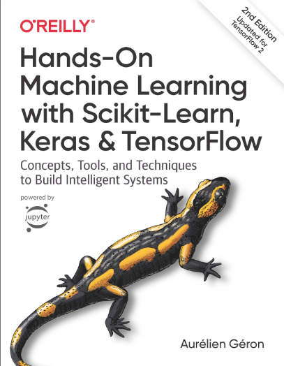
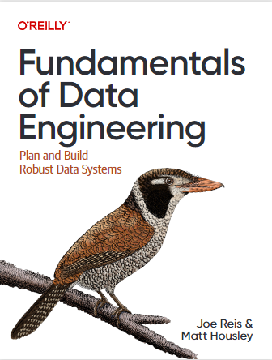
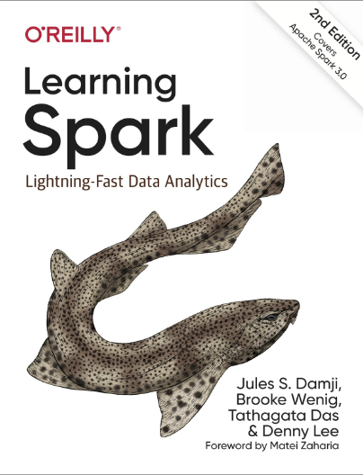
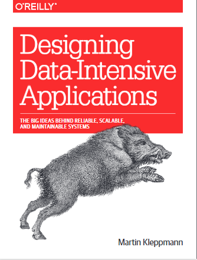
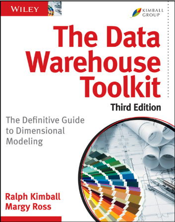
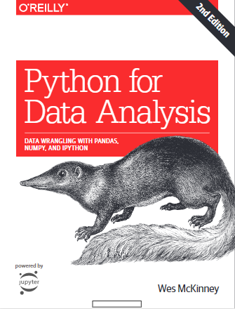

# Databricks Pyspark Learning

## Objetivo
El objetivo de este repositorio es documentar todos los pasos que se irán ejecutando a medida que se vaya desarrollando el curso de <a href="https://www.udemy.com/share/105xCs3@-eoDtVbZvDfj-nAU4BB-diKG0bm65zvI7bHf6OfHbPodXbLAGmAC2yDYtGsKEf5-/" target="_blank">Databricks y Apache Spark para Big Data: de cero a experto</a>
___________
## Recursos

- **Curso**: <a href="https://www.udemy.com/share/105xCs3@-eoDtVbZvDfj-nAU4BB-diKG0bm65zvI7bHf6OfHbPodXbLAGmAC2yDYtGsKEf5-/" target="_blank">UDemy: Databricks y Apache Spark para Big Data: de cero a experto</a>
- **Canal de youtube**: <a href="https://youtube.com/playlist?list=PLyLR_xjGDGcAwt7jmaBW1lAYspcpswRYy" target="_blank">Youtube: Databricks Pyspark Learning</a>
- **Repositorio**: <a href="https://github.com/fnsalinas/databricks_pyspark_learning.git" target="_blank">Repo: Databricks Pyspark Learning</a>
- **Databricks Community Edition**: <a href="https://community.cloud.databricks.com/login.html" target="_blank">Databricks Community Edition</a>  
- **Documentación Apache Spark**:  <a href="https://spark.apache.org/">spark.apache.org</a>
- **Documentación Kubernetes en AWS**: <a href="https://docs.aws.amazon.com/eks/">docs.aws.amazon.com/eks</a>
___________
## Libros

<table>
    <tr>
        <td>
            <a href="https://1drv.ms/b/s!AniDXLYsIpTn3d9iZUveqV2Vo4HQUw?e=tYixzl" target="_blank">
                </img>
            </a>
            <a href="https://1drv.ms/b/s!AniDXLYsIpTn3d9eGCdC6uVoyqbvsg?e=GbIlTU" target="_blank">
                </img>
            </a>
            <a href="https://1drv.ms/b/s!AniDXLYsIpTn3d9fMFZmWvQeCUcCGA?e=L5TLd3" target="_blank">
                </img>
            </a>
            <a href="https://1drv.ms/b/s!AniDXLYsIpTn3d9h-fp6EYTGvP-YRg?e=vsPC6Y" target="_blank">
                </img>
                </a>
            <a href="https://1drv.ms/b/s!AniDXLYsIpTn3d9g-DoucQS5mzqgmQ?e=bPfobE" target="_blank">
                </img>
            </a>
            <a href="https://1drv.ms/b/s!AniDXLYsIpTn3d9jO_hY1VE9TR8TbA?e=rhNanF" target="_blank">
                </img>
            </a>
        </td>
    </tr>
</table>

___________
## Contenido

### **Seccion 1**: Introducción
1. --
2. Fundamentos de Spark. [<a href="https://www.youtube.com/watch?v=bApGhYlbD5w">Video 1</a>]
3. ¿Cómo se ejecuta Apache Spark? [<a href="https://www.youtube.com/watch?v=bApGhYlbD5w">Video 1</a>]
4. Ecosistema de Apache Spark y Documentación oficial. [<a href="https://www.youtube.com/watch?v=bApGhYlbD5w">Video 1</a>]
5. PySpark: funcionamiento, Administración de Clusteres y Arquitecura. [<a href="https://www.youtube.com/watch?v=bApGhYlbD5w">Video 1</a>]
### **Seccion 2**: Spark DataFrames y Apache Spark SQL
6. Material y código del módulo. -> <a href="https://github.com/fnsalinas/databricks_pyspark_learning/blob/main/notebooks/2.%20Fundamentos%20de%20Spark_SQL_DataFrames.ipynb">2. Fundamentos de Spark_SQL_DataFrames.ipynb</a> [<a href="https://www.youtube.com/watch?v=bApGhYlbD5w">Video 1</a>]
7. Fundamentos y ventajas de los DataFrames. [<a href="https://www.youtube.com/watch?v=bApGhYlbD5w">Video 1</a>]
8. Caracteristicas de los DataFrames y Fuentes de Datos. [<a href="https://www.youtube.com/watch?v=bApGhYlbD5w">Video 1</a>]
9. Creación de DataFrames en PySpark.
10. Operaciones con DataFrames de PySpark.
11. Diferentes tipos de JOINS en DataFrames.
12. Consultas SQL en PySpark.
13. Funciones avanzadas para cargar y exportar datos en PySpark.
### **Seccion 3**: Funciones avanzadas de Spark
___________
## Organización del repositorio
